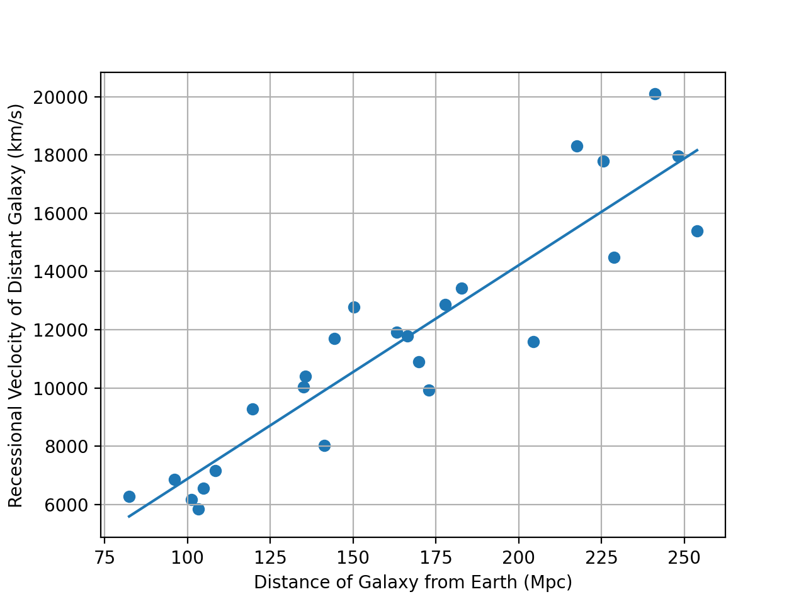

# Measuring the Hubble constant from galaxy spectra

Year 1 computing project, MSci Physics, Imperial College London (November 2025). Python, NumPy, SciPy, Matplotlib.

**Result:** H₀ = 73.3 ± 6.5 km/s/Mpc

## Method
1. Parse galaxy observation numbers and distances from a text file (`strip()` / `split()`, skipping non-data lines).
2. For each galaxy, fit its spectrum around the Hβ line (rest wavelength 486.1 nm) with a **Gaussian plus a straight line**: the Gaussian models the hydrogen emission line, the line models the stellar continuum (`scipy.optimize.curve_fit`, with initial guesses read from each spectrum).
3. Convert the fitted line centre to an observed wavelength, then to a recessional velocity with the Doppler shift.
4. Fit velocity against distance by least squares (`numpy.polyfit(..., cov=True)`). The slope is H₀, and its uncertainty comes from the covariance matrix.

## Running it
`python3 hubble_computing_project.py`, with `dist_data.txt` and `SpectralData_Hbeta.csv` in the same folder. The data files were supplied with the course and aren't included here.
